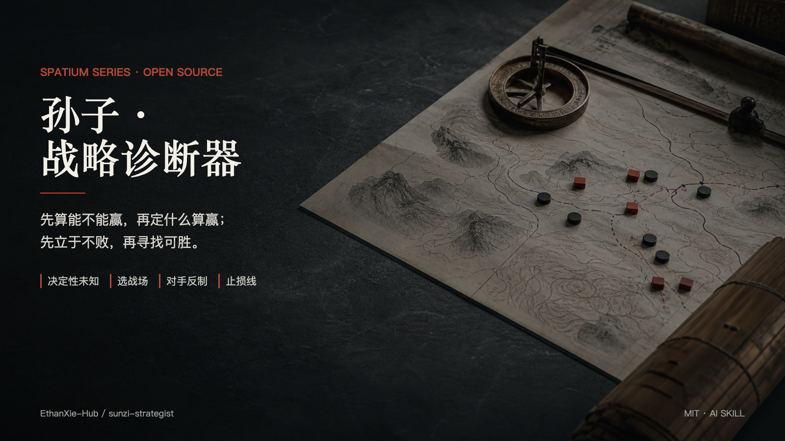
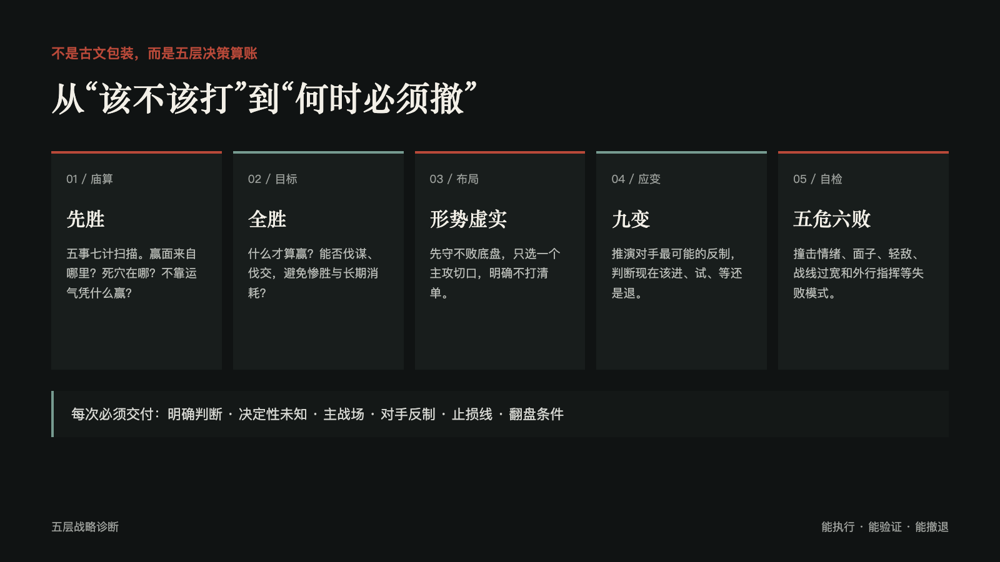
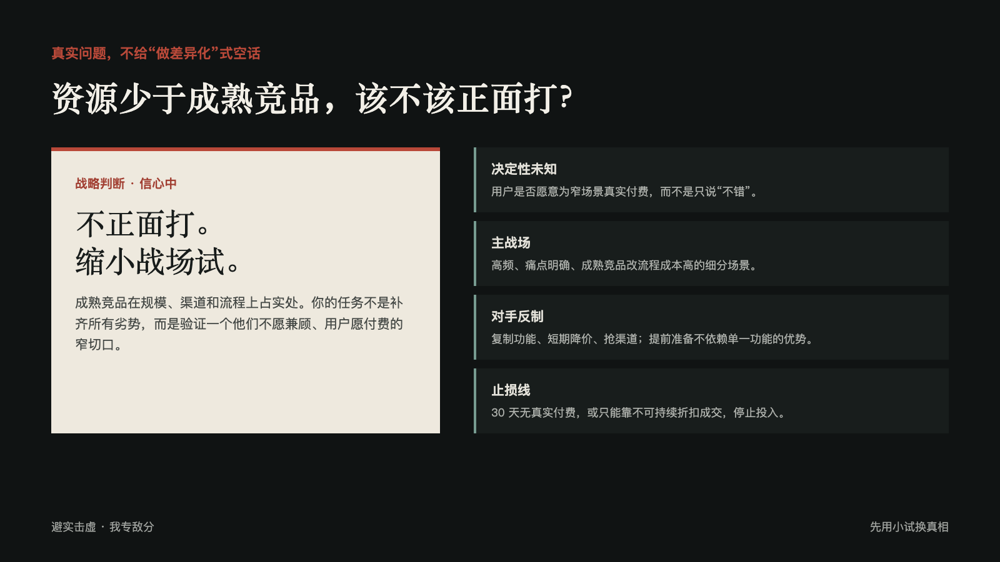
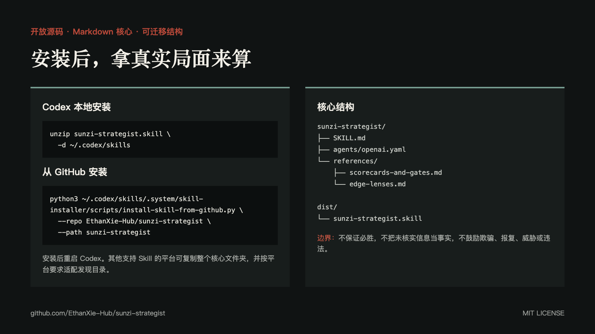

# 孙子·战略诊断器

[](https://github.com/EthanXie-Hub/sunzi-strategist/releases/latest)
[](https://github.com/EthanXie-Hub/sunzi-strategist/actions/workflows/checks.yml)
[](LICENSE)



一个把《孙子兵法》转成现代决策算账框架的 AI Skill。

它不负责给普通建议套古文，也不鼓励逞强、硬刚或操纵。它处理的是：

- 有限资源、信息不全、有对手或现实阻力的对抗局
- 高风险、不易撤回、代价很高的重大选择
- 商业竞争、市场进入、谈判、组织僵局与项目取舍
- 已有计划的反制推演、失败复盘和止损审计

> 先算能不能赢，再定什么算赢；先立于不败，再寻找可胜；先选战场，再谈打法。

三层架构：兵法知识 / 现实问题诊断器 / 反馈学习循环。当前版本见上方徽章，更新明细见 [CHANGELOG](CHANGELOG.md)。

## 它交付什么

每次战略诊断必须落到：

1. **判断**：进、退、缩小试、暂缓，还是先侦察。
2. **决定性未知**：哪个信息最可能翻转结论，如何低成本拿到。
3. **赢的定义**：什么结果才算赢，哪些代价不能付。
4. **主战场**：在哪打、避开什么、只集中突破哪一处。
5. **行动打法**：你动一步，对手如何回应，你再怎么接。
6. **止损线**：何时撤、何时换打法、何时不再投入。
7. **翻盘条件**：什么事实会推翻当前判断。

## 五层诊断



| 层 | 现实问题 |
| --- | --- |
| 先胜 · 五事七计 | 不靠运气，凭什么能赢？死穴在哪里？ |
| 全胜 · 伐谋 | 什么才算赢？怎样用最小代价拿完整成果？ |
| 形势 · 虚实 | 如何先守住不败，再只打一个薄弱切口？ |
| 九变 · 因敌 | 对手会如何反制？何时进、试、等、退？ |
| 五危 · 六败 | 是否被情绪、面子、轻敌或战线过宽拖垮？ |

七计评分、市场进入五关、90 天验证计划和对手反制清单位于 `references/scorecards-and-gates.md`；全书五类台账（框架/原则/技法/反模式/作者声音，含原文锚点与核心/边角分级）位于 `references/framework-ledger.md`。

## 它与普通战略建议的区别

- 不用“信息不足”逃避判断，而是锁定一个决定性未知并给侦察法。
- 不只给总分，而是指出最该补的 1 至 3 项和补分动作。
- 不把正面冲突当勇敢，优先伐谋、伐交、避实击虚。
- 不把短期胜利当胜利，主动保护现金流、声誉、组织能力和退路。
- 不把兵法变成操纵术；欺骗信任关系、报复与违法不是战略。



## 安装

### 下载安装包（推荐）

每个版本的安装包由 CI 自动构建并附在 [Releases](https://github.com/EthanXie-Hub/sunzi-strategist/releases/latest)，最新版固定直链：

```bash
curl -L -o sunzi-strategist.skill \
  https://github.com/EthanXie-Hub/sunzi-strategist/releases/latest/download/sunzi-strategist.skill

# Codex
unzip sunzi-strategist.skill -d ~/.codex/skills
# Claude Code
unzip sunzi-strategist.skill -d ~/.claude/skills
```

claude.ai：设置 → Capabilities → Skills，直接上传 `sunzi-strategist.skill`。安装后重启对应客户端。

### 从 GitHub 安装到 Codex

```bash
python3 ~/.codex/skills/.system/skill-installer/scripts/install-skill-from-github.py \
  --repo EthanXie-Hub/sunzi-strategist \
  --path sunzi-strategist
```

### 其他支持 Skill 的平台

核心能力采用可迁移的 Markdown 结构，位于 `sunzi-strategist/SKILL.md` 与 `references/`。将整个 `sunzi-strategist/` 文件夹复制到平台要求的 Skill 目录即可。

不同平台的发现目录、元数据与自动触发机制可能不同；`agents/openai.yaml` 是 OpenAI/Codex 的可选界面元数据。



## 使用

```text
$sunzi-strategist
我们资源明显少于竞品，但想进入他们占优的市场。该不该正面打？
请给我决定性未知、主战场、对手反制和止损线。
```

也可以直接描述一个真实僵局、重大选择或竞争问题。Skill 会先判断这是否真是战略问题，简单问题不会硬套五层框架。

在几个方案间纠结时，说「帮我对比 A / B / C」走对比决策模式；行动结束后回来说「复盘」，按 AAR 七问归因（信息不足 / 框架误用 / 执行失败 / 环境变化），经验沉淀进下一个版本。输出深度参考 `sunzi-strategist/examples/` 的 5 个真实范例（价格战、开店、选 offer、同事冲突、客户复购）。

## 三层架构与仓库结构

第一层**兵法知识**（`references/`）支撑第二层**诊断器**（`SKILL.md`）；第三层**反馈学习循环**（`feedback/` + `evals/`）让诊断质量随使用迭代——学习发生在**版本之间**（人工 review、可回滚、记入 CHANGELOG），不发生在运行之中，skill 不会自动改写自己的 Prompt。

```text
.
├── sunzi-strategist/              # 第二层 · 诊断器（整个文件夹即 Skill 本体，可直接拷走）
│   ├── SKILL.md                   #   主 Prompt：6 原则 / 五层流程 / 输出模式 A–F / 质量闸门
│   ├── agents/openai.yaml         #   OpenAI/Codex 可选元数据
│   ├── references/                # 第一层 · 兵法知识
│   │   ├── framework-ledger.md    #   全书台账：原文锚点 + 核心/边角分级
│   │   ├── scorecards-and-gates.md#   七计评分 / 市场五关 / 90 天验证 / 对手反制
│   │   └── edge-lenses.md         #   边角透镜
│   ├── examples/                  #   5 个真实诊断范例（输出校准用）
│   └── feedback/                  # 第三层 · 运行侧：反馈 schema / AAR 七问 / 学习循环
├── evals/                         # 第三层 · 验收侧：20 用例 / 评分细则 / 回归清单 / static-checks.py
├── dist/sunzi-strategist.skill
├── docs/open-source-launch.zh-CN.md
├── examples/real-world-strategy-diagnoses.md
├── AUDIT_REPORT.md · REFACTOR_PLAN.md · CHANGELOG.md
└── assets/promo/
```

## 边界

- 不用于纯执行任务、无决定的闲聊或纯情绪倾诉。
- 不把未经核实的市场、政策、竞品与财务信息写成事实。
- 不鼓励欺骗、报复、威胁、违法或破坏长期信任。
- 不保证结果；评分与判断必须带假设、置信度、止损线和翻盘条件。

## 验证

```bash
python3 evals/static-checks.py
```

38 项自动静态检查：frontmatter 约束、诊断骨架段落、链接完整性、必备文件、`.skill` 包卫生（不含 `.git`/`evals`）。模型行为探针（伦理护栏 / 数据诚实 / 简单题不套框架）见 `evals/regression-checklist.md`，改动 SKILL.md 后必跑。

结构有效不代表每次战略判断天然正确。真实决策仍需事实验证、现实反馈与及时止损。

## 贡献

欢迎提交能暴露框架缺陷的真实战略问题、对手反制、评分修正、失败复盘与平台适配。参见 [CONTRIBUTING.md](CONTRIBUTING.md)。

高质量复盘按 `sunzi-strategist/feedback/learning-loop.md` 进入版本迭代：反馈聚合 → 改进建议 → 人工 review → 改动 → 回归测试 → CHANGELOG。单一案例不改规则（防过拟合），越线建议直接拒绝并留档（防漂移）。

## License

[MIT](LICENSE)

---

**English summary:** Sunzi Strategist turns Sun Tzu's layered strategic lenses into evidence-aware modern decision diagnoses with a decisive unknown, battlefield choice, opponent reactions, action thresholds, and stop-loss criteria.
